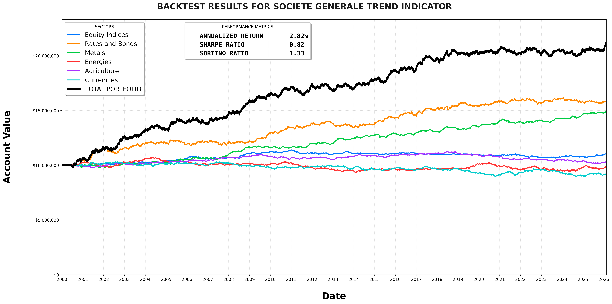

# FuturesBacktestingEngine
**Institutional-grade replication of the Société Générale Trend Indicator**

## Overview
This project is a high-performance futures backtesting engine designed to simulate medium-to-long-term trend-following strategies. Built by a former Hedge Fund Quant and National Lab R&D Engineer, the framework focuses on vectorized performance and modular signal architecture.

It replicates the core logic used in institutional trend-following benchmarks, utilizing moving average crossovers and volatility-adjusted position sizing across a diversified portfolio of 57 synthetic futures markets.

## Project Structure
The repository is organized into a modular architecture to separate logic from data artifacts:

* `src/`: Core Python engine.
    * `generator.py`: Generates synthetic price data (OHLC) using Brownian Motion.
    * `engine.py`: Defines market mechanics (Big Point Value, tick sizes).
    * `models.py`: Contains the 20/120 Simple Moving Average crossover signal logic.
    * `main.py`: Orchestrates the backtest and performance calculations.
    * `visualize_data.py`: Debugging tool for data inspection and plotting.
* `plots/`: Stores the generated strategy equity curve and visualizations.
* `data/`: (Local only) Stores generated synthetic market history.

## Technical Expertise
* **Vectorized Backtesting:** Optimized for high-speed research using NumPy and Pandas.
* **Institutional Risk Metrics:** Calculates Sharpe and Sortino ratios to validate strategy robustness.
* **Modular Design:** Signal logic is decoupled from the execution engine for easy strategy iteration.

## Quick Start
1. **Initialize the Environment:**
   Ensure you have Python 3.x installed with Pandas, NumPy, and Matplotlib.
   
2. **Generate Market Data:**
   `python src/generator.py`

3. **Run Backtest:**
   `python src/main.py`

## Results
The backtester generates a performance equity curve and risk-adjusted return summaries.

---
**Disclaimer:** *This engine is for research and backtesting purposes only. Futures trading involves substantial risk of loss. No financial advice is provided.*